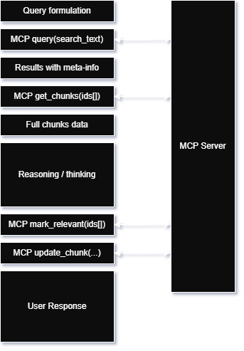
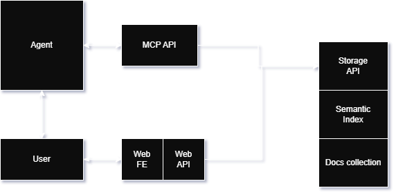

<p align="center">
    
</p>


# Cortex

> Persistent memory for LLM-powered co-thinking. MCP-native. Action-oriented.

## Why Cortex

Every serious PKM system eventually becomes a graveyard. You capture insights, tag them thoughtfully, build elaborate folder structures-and three years later you have 10,000 notes you've forgotten exist. The system was supposed to compound. Instead, it accumulated.

Discipline isn't the problem. The problem is that retrieval requires you to remember what you know and formulate the right search query. You can't search for things you've forgotten.

Cortex fixes this by making an LLM the primary interface to your knowledge base. The AI retrieves what's relevant to the current conversation, reasons with it, and-critically-*gardens* the knowledge base as a byproduct of use. New insights get stored. Stale content gets deprecated. Tags that don't work get refined. The system learns what matters by observing what actually proves useful.

The result: a PKM system that maintains itself, and knowledge that surfaces when it's relevant rather than when you remember to look for it.

**[Read the full design paper here →](linkedin-post-link)**

---

## Quickstart

### Prerequisites
- Node.js 18+
- An MCP-compatible client (Claude Desktop, Cursor, etc.)

### Installation

```bash
git clone https://github.com/joel-solymosi/cortex
cd cortex
npm install
npm run
```

### Running the Server

```bash
npm start
```

Environment options:
| Variable | Description | Default |
|----------|-------------|---------|
| `MEMORY_DATA_DIR` | Data directory for your vault | `./data` |
| `PORT` | HTTP server port | `8010` |

### Verify It's Working

Open http://localhost:8010/memory in your browser to see your vault.

---

## Integrations

### Claude Desktop

Add to your `claude_desktop_config.json`:

```json
{
  "mcpServers": {
    "memory": {
      "type": "url",
      "url": "http://localhost:8010/mcp/memory"
    }
  }
}
```

Restart Claude Desktop. The memory tools will now be available.

### System Prompt Setup

The LLM needs instructions on *how* to use memory, not just access to tools.

Copy the contents of `prompt.md` into your system prompt (or use Claude's "Project" feature to attach it as project instructions). This contains:
- The retrieval → think → garden → respond workflow
- Guidance on what to store, when to update, when to deprecate
- Citation format for transparency
- Quality signals for corpus maintenance

> ⚠️ **The prompt is opinionated.** It assumes you want the AI to actively garden your knowledge base during conversation. If you want read-only memory, modify the prompt to remove write operations.

---

## How It Works

### The Loop

Every conversation turn follows this sequence:




### System Architecture



### Why Two-Phase Retrieval?

Semantic search returns many potential matches. Rather than stuffing all of them into context (expensive, noisy), Cortex returns metadata first-summaries, tags, related other chunks. The LLM scans this to decide what's actually worth retrieving in full.

This lets the model reason about *what to read* before reading it. It can follow relationship links, do additional targeted searches, or decide that nothing retrieved is relevant. RAG systems can't do this-they blindly return top-k results.

### Relevance Metrics

Every chunk tracks:
- `retrieved_count` - how often it matched a query
- `relevant_count` - how often it was actually cited/used
- `last_relevant_date` - when it was last useful

The ratio `relevant/retrieved` is a precision signal. High retrieval but low relevance = tags too broad or content stale. This drives empirical gardening-the system learns what works.

---

## API Reference

### MCP Tools

| Tool | Description |
|------|-------------|
| `store_chunk(content, metadata)` | Create new chunk. Returns chunk ID. |
| `update_chunk(id, metadata?, content?)` | Update existing chunk. |
| `query(search_text, limit?)` | Semantic search. Returns metadata only. |
| `get_chunks(ids[])` | Retrieve full content by ID. |
| `mark_relevant_chunks(ids[])` | Increment relevance counters. |
| `mark_obsolete(id, reason)` | Archive chunk with reason. |
| `get_audit_log(since?)` | View operation history. |
| `memory_stats()` | Corpus statistics. |

### HTTP Endpoints

| Endpoint | Description |
|----------|-------------|
| `GET /memory` | Web UI for browsing vault |
| `GET /memory/chunk/:id` | Individual chunk view |
| `GET /memory/stats` | Corpus statistics |
| `/mcp/memory` | MCP endpoint for LLM clients |

---

## Data Storage

Chunks are stored as individual Markdown files in `{data_dir}/chunks/`.

```
data/
└── chunks/
    ├── a1b2c3.md
    ├── d4e5f6.md
    └── ...
```

This means:
- **Human-readable**: Open any chunk in your editor
- **Obsidian-compatible**: Point Obsidian at your data directory and browse your vault directly
- **Git-friendly**: Version control your knowledge base
- **No lock-in**: It's just Markdown. Walk away anytime.

---

## License

MIT

---

## Building in This Space?

If you're working on LLM-augmented cognition, agentic knowledge systems, or tool-use architectures-I'd like to hear what you're trying. Feel free reach out!
joel@custlabs.com

